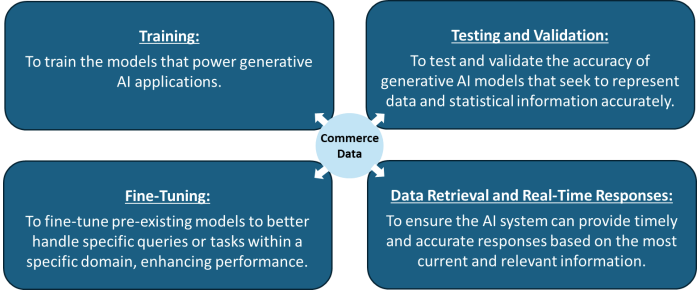
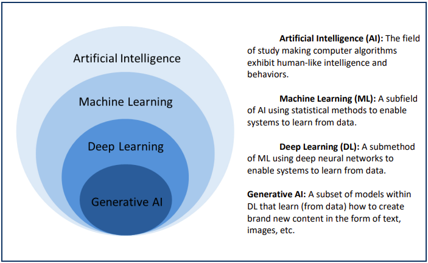
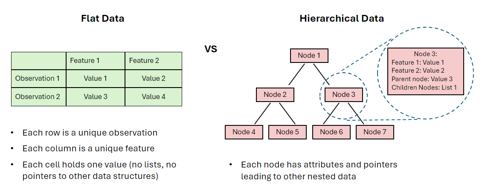
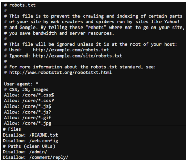
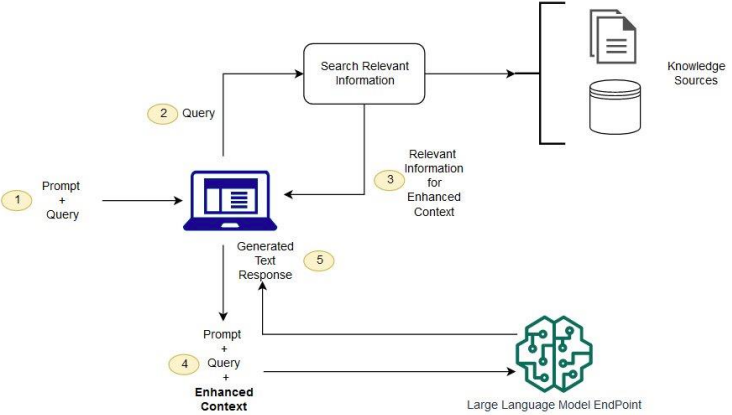
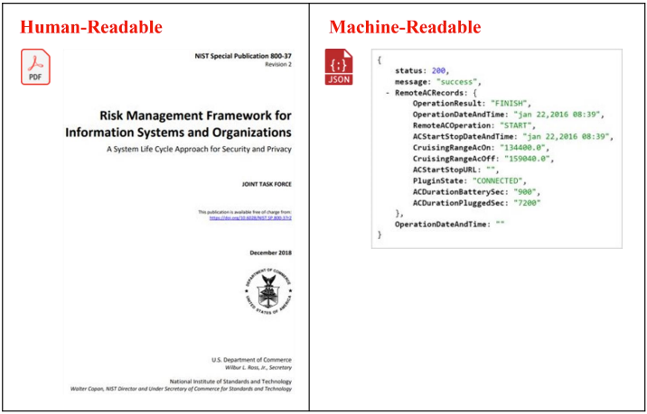
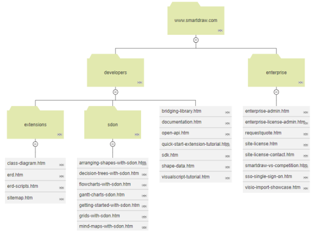

# Generative Artificial Intelligence and Open Data: Guidelines and Best Practices

> **Release Notes:**
> - Version 1
> - Last Updated January 16, 2025
> - Background Info: [Commerce Blog Post](https://www.commerce.gov/news/blog/2025/01/generative-artificial-intelligence-and-open-data-guidelines-and-best-practices)
> - Citations and footnotes can be found in the PDF version:
>   - [Download via commerce.gov](https://www.commerce.gov/sites/default/files/2025-01/GenerativeAI-Open-Data.pdf)
>   - [Download via GitHub](https://github.com/DOC-OUSEA-CDO/generative-ai-and-open-data-guidelines-and-best-practices/blob/main/GenAI_Open_Data_Guidelines_%26_Best_Practices.pdf)  

#### About the Commerce Data Governance Board

The Commerce Data Governance Board was established to fulfill the requirements set forth in the Foundations for Evidence-Based Policymaking Act of 2018 (Evidence Act) and Office of Management and Budget Memorandum M-19-23. The Board's mission is to optimize the use of Commerce Department data as a strategic asset, ensuring alignment with the objectives of the Evidence Act. The Board is responsible for guiding the implementation of the Act within the Department, coordinating and preparing key deliverables, and providing comprehensive updates and reports to the White House Office of Management and Budget, as well as Congress.

#### About the AI and Open Government Data Assets Working Group

The Commerce Data Governance Board established the AI and Open Government Data Assets Working Group in Q4 2023 to address the opportunities and challenges presented by the rapid advancement of generative artificial intelligence (AI) and its use of open data. This group, composed of experts in data management and AI from across Commerce, have worked collaboratively with outside partners including industry, academia, and other stakeholders within the public data ecosystem to establish innovative data dissemination practices that align with the evolving needs of data users and AI systems.

#### About this Document

Generative Artificial Intelligence and Open Data: Guidelines and Best Practices provides guidance when publishing open data for use by generative AI systems. This document is intended for use by the Department of Commerce and its bureaus, but is published publicly for use by data publishers globally. This is intended to be a living document that will be revised and updated based upon new information, feedback, and other considerations.

#### Copyright Information

This document was created by the United States Government and therefore is not subject to copyright in the United States (see 17 U.S.C. §105). Subject to the stipulations below, it may be distributed and copied; further, the Department of Commerce requests acknowledgement as to the source of the document. Copyrights to graphics included in this document are reserved by the original copyright holders or their assignees and are used here with permission and under a license to the Government. Requests to use any images must be made to the provider identified in the image credits or to the Department of Commerce if no provider is identified. Published in the United States of America, 2024.

#### Disclaimer

Mention of or referral to any product, service, individual, organization or other enterprise in this document, including citations or links to non-government sites, is not and does not imply official Department of Commerce or government endorsement of those entities. The opinions and ideas of non-government entities are theirs alone.

#### Citation Guidance

AI and Open Government Data Assets Working Group (January 16, 2025). Generative Artificial Intelligence and Open Data: Guidelines and Best Practices. Department of Commerce, Washington, DC. [URL](https://github.com/DOC-OUSEA-CDO/generative-ai-and-open-data-guidelines-and-best-practices).

## Acknowledgements

The Commerce Data Governance Board, chaired by Oliver Wise, Chief Data Officer and Acting Under Secretary for Economic Affairs, chartered the AI and Open Government Data Assets Working Group in late 2023. The Working Group is composed of data and AI experts throughout the Department of Commerce who contributed their expertise to the development of this guidance.

### AI and Open Government Data Assets Working Group

#### Chair

- Dr. Sallie Ann Keller, Chief Scientist, U.S. Census Bureau

#### Staff Lead

- Victoria Houed, Director of AI Policy and Strategy, Office of the Under Secretary for Economic Affairs

#### Members

- Razvan Amironesei, National Institute of Standards and Technology
- Susan Allen, United States Patent and Trademark Office
- Scott Beliveau, United States Patent and Trademark Office
- Harold Booth, National Institute of Standards and Technology
- Michael Cannon, Office of the General Counsel
- Chakib Chraibi, National Technical Information Service
- Tyler Christensen, National Oceanic and Atmospheric Administration
- Melissa Creech, U.S. Census Bureau
- Megan Cromwell, National Oceanic and Atmospheric Administration
- Dr. Dominique Duval-Diop, Office of the Under Secretary for Economic Affairs
- Rafi Goldberg, National Telecommunications and Information Administration
- Jeffrey Hall, International Trade Administration
- Ryan Harper, U.S. Census Bureau
- Kenneth Haase, U.S. Census Bureau
- Paul Iwugo, Bureau of Economic Analysis
- Nathan Jones, U.S. Census Bureau
- Luke Keller, U.S. Census Bureau
- Amanda Lyndaker, Bureau of Economic Analysis
- Brian Quistorff, Bureau of Economic Analysis
- Douglas Rao, National Oceanic and Atmospheric Administration
- Allison Shafer, U.S. Census Bureau

#### Additional Staff

- Kanmani Duraikkannan, Office of the Under Secretary for Economic Affairs
- Oana Enache, Office of the Under Secretary for Economic Affairs
- Matilda Gaddi, Office of the Under Secretary for Economic Affairs
- Bella Mendoza, Office of the Under Secretary for Economic Affairs
- Zach Palmer, Office of the Under Secretary for Economic Affairs

## Table of Contents

- **Acknowledgements**
- **Table of Contents** 
- **Message from Chief Data Officer**
- **Executive Summary**
- **Part I: Background**
	- The Department of Commerce and its Open Data Assets
	- The Growth of Artificial Intelligence and Generative Artificial Intelligence
	- Development of the Guidelines and Best Practices
- **Part II: Guidelines and Best Practices**
	- 1.0 Documentation
		- Guideline 1.1 Provide comprehensive context about data assets in documentation.
		- Guideline 1.2 Maximize the availability and accessibility of documentation
	- 2.0 Data and Metadata Formats
		- Guideline 2.1 Publish comprehensive and structured data and metadata.
		- Guideline 2.2 Maximize the availability and accessibility of data and metadata
	- 3.0 Data Storage and Dissemination
		- Guideline 3.1 Disseminate open data in consistent formats
		- Guideline 3.2 Store open data in easily retrievable locations
	- 4.0 Data Licensing and Usage
		- Guideline 4.1 Publish comprehensible open data rights and permissions in accessible and accepted formats
		- Guideline 4.2 Develop and update data licenses and usage policies collaboratively.
	- 5.0 Data Quality and Integrity
		- Guideline 5.1 Prepare open data for high quality data retrieval
		- Guideline 5.2 Continuously evaluate open data for accuracy
- **Future Work**
- **Conclusion**
- **Appendix**
	- A1. Glossary and additional background information
	- A2. Frequently recommended technologies by RFI respondents, the AI and Open Government Data Assets Working Group, and the AI-Ready Data Workshop
	- A3. Interaction between Schema.org, Croissant, and Hugging Face

## Message from the Chief Data Officer

In an age defined by rapid technological transformation, the way we publish and engage with data must evolve to meet rising user expectations. The widespread adoption of mass-market generative artificial intelligence (AI) has made it easier than ever for people from all walks of life to interact with complex datasets. To meet these new expectations, the Department of Commerce (Commerce), as a steward of some of the nation’s most valuable open data assets, is committed to leading this transformation responsibly and effectively.

For decades, Commerce has continuously updated the way it processes and publishes data to reflect innovations in technology. From early efforts to digitize records to the adoption of machine-readable formats in the 2010s, our practices have evolved to ensure that our data remains accessible, useful, and impactful. Now, as generative AI redefines how users engage with information, we are again poised to adapt and innovate.

Our data has long been a cornerstone for policymaking, economic innovation, and scientific discovery. Yet, as AI tools become intermediaries in data interpretation, the current approach of "machine-readability" is no longer sufficient. To ensure that public data retains its value and integrity in this new paradigm, we must embrace practices that make data not only machine-readable but machine-understandable. This means preserving the meaning and context of the data in ways that generative AI systems can accurately interpret and utilize.

The AI and Open Government Data Assets Working Group, chartered under Commerce's Data Governance Board and chaired by the Chief Scientist, U.S. Census Bureau, Sallie Ann Keller, has taken a pioneering step forward in addressing this challenge. By engaging with experts across sectors and incorporating diverse insights, this report provides actionable guidelines and best practices to prepare public data for generative AI systems. These recommendations reflect our commitment to enhancing data quality, accessibility, and trustworthiness, ensuring that our data supports meaningful, accurate, and reliable outcomes for all users.

This report is primarily intended to guide data stewards and publishers across the Department of Commerce as they navigate this new era. However, we also hope it serves as a resource for data stewards everywhere—across governments, academia, and the private sector—by offering insights on how public data can be structured and disseminated to better interact with large language models (LLMs) and other generative AI systems.

I want to thank the wide range of experts who contributed to this report, especially the members of the AI and Open Government Data Assets Working Group. Their deep expertise in fields such as computer science, social science, natural science, and data management has been invaluable in shaping these guidelines. Their dedication to this effort ensures that the Department of Commerce remains at the forefront of innovation in data stewardship.

We invite you to join us in this effort. Whether you are part of government, academia, industry, or civil society, your partnership is vital as we navigate this transformational era. Together, we can unlock the full potential of open data in the age of AI, empowering users to derive insights that shape a more informed, innovative, and trusted future.

Sincerely,

**Oliver Wise**

Chief Data Officer

Performing the non-exclusive functions and duties of the Under Secretary for Economic Affairs

U.S. Department of Commerce

## Executive Summary

The Department of Commerce (Commerce) is a premier provider of data for the American public, publishing information on a wide range of topics including people, the environment, and the U.S. economy. These data enable evidence-based policymaking, scientific discovery, innovation, and economic growth, serving as an invaluable resource to the country and to the world. It is within Commerce’s mission to publish data that serves the American public, and within Commerce’s strategic goals to “expand opportunity and discovery through data.” In pursuit of these goals, Commerce is dedicated to continuously refining its processes for creating, curating, and distributing its data to best meet the needs of the American public, especially as new technologies emerge.

In part due to the potential to support its mission and strategic goals, Commerce is exploring the optimization of its open data for artificial intelligence. Over the last decade, artificial intelligence and machine learning (AI/ML) systems, which are trained using large quantities of data to probabilistically generate predictions or synthetic output, have increasingly utilized Commerce’s robust data assets. Due to open data initiatives like Title II of the Evidence Act, Commerce’s open data are currently disseminated in “machine-readable” formats, which was a sufficient standard for building early AI/ML systems. However, as these systems have advanced and risen in popularity, Commerce has begun to reevaluate whether its current open data practices are sufficient to keep pace with current and future AI/ML systems and their users.

Generative AI applications, which typically generate synthetic media in response to natural language and multi-modal prompts, have immense potential to create new, easier ways for American communities to interact with public data. For instance, generative AI systems can enable non-technical users to engage with complex data collections through chat-like interfaces.

Due to the promise of generative AI’s capabilities, Commerce launched the AI and Open Government Data Working Group in late 2023, tasked with assessing how the Department can create, curate, and distribute its open data assets to facilitate the development and advancement of generative AI systems and meet the needs of users who leverage these emerging technologies to interact with Commerce open data. The working group published the AI and Open Government Data Assets Request for Information (RFI) and hosted workshops with AI and data experts from Commerce, other federal agencies, the private sector, think tanks, and academia. Through its research, the working group affirmed that generative models are trained on a large corpus of public data (including many Commerce resources) and that the public is increasingly interacting with Commerce data, using generative AI models as an intermediary.

As Commerce's open data becomes increasingly integrated into generative AI systems, there is a growing need for Commerce to disseminate generative AI-ready data assets. Commerce aims to achieve two primary objectives as its open data interacts with generative AI systems:

1. **Enhance the accuracy of AI responses:** When a user queries a generative AI model with a question requiring Commerce data (e.g., “What is the population of Suitland, MD?”), the Commerce data produced for a user is accurate, properly represented, and properly sourced.

2. **Increase the prioritization of authoritative data:** Commerce needs to ensure that its data are prioritized over non-authoritative and potentially inaccurate sources in AI-generated responses.

To properly address these objectives, Commerce first familiarized itself with how its open data is utilized within the generative AI development process. The working group found that Commerce’s open data are utilized within the generative AI development process in four key ways: training, fine-tuning, testing and validation, and data retrieval and real-time responses.

*Figure 1: Commerce open data is utilized in four unique ways in the generative AI system development process.*

In each of the processes shown in Figure 1, Commerce aims to ensure open data are accessible and usable to users in order to mitigate bias and loss of quality when open data are accessed through generative AI tools. This document provides guidance for Commerce as it prepares and publishes generative AI-ready open data, or open data that can be responsibly and effectively used by generative AI systems. Although this guidance is primarily for use within Commerce, it is also designed to serve as a valuable resource for open data publishers across all levels of government, as well as in the nonprofit and private sectors.

This guidance covers five major interrelated topics which are broken down into ‘Guidelines’ and ‘Best Practices’ for achieving generative AI-readiness:

**1.0 Documentation**: *Documentation* refers to the process of recording, describing, and contextualizing data to make it understandable and usable. Documentation not only enhances the transparency and reproducibility of data but also provides the necessary contextual understanding needed for generative AI systems to effectively interpret and derive meaningful patterns from data. It is recommended that Commerce:

- *Guideline 1.1:* Provide comprehensive context about data assets in documentation
	- 1.1.1 Provide helpful characteristics of open data within documentation
	- 1.1.2 Implement persistent identifiers (PIDS)
	- 1.1.3 Update documentation with each data release and use version control
	- 1.1.4 Provide version controlled open-source code for data processing
- *Guideline 1.2:* Maximize the availability and accessibility of documentation
	- 1.2.1 Provide documentation in both human and machine-readable formats
	- 1.2.2 Use open-source software formats, where appropriate

**2.0 Data and Metadata Formats**: *Metadata* refers to structured information about an information resource that helps retrieve, use, or manage that resource. Metadata aids in the understanding of one or more aspects of the data, such as its source, type, owner, or relationship to other datasets. Together, Data and Metadata Formats provide data users with crucial supplementary details, supporting consistency, interoperability, and integration across systems. It is recommended that Commerce:
- *Guideline 2.1:* Publish comprehensive and structured data and metadata
	- 2.1.1 Include generative AI-relevant information in metadata at the dataset level (e.g., publisher, provenance, rights, update/modification date)
	- 2.1.2. Add comprehensive variable-level metadata for machine understandability
	- 2.1.3 Publish metadata aligned with commonly used metadata schemas and standards
	- 2.1.4 Use standard missing data values within data and metadata
	- 2.1.5 Ensure consistent and unambiguous file naming conventions
- *Guideline 2.2:* Maximize the availability of data and metadata
	- 2.2.1 Produce data and metadata in machine-readable formats
	- 2.2.2 Data should be available in commonly used open data formats
	- 2.2.3 Use file structures that reduce structural ambiguity
	- 2.2.4 When possible, make both raw and derived data versions available

**3.0 Data Storage and Dissemination**: *Data Storage and Dissemination* refers to methods used to store and distribute Commerce open data for generative AI development. Commerce should improve the navigation and retrieval of its open data to shape the accessibility and usability of its data across diverse application domains. It is recommended that Commerce:
- *Guideline 3.1:* Disseminate open data in consistent formats
	- 3.1.1 Large datasets should be compressed or easily downloadable
	- 3.1.2 Compress large data files using open-source and language agnostic file formats
	- 3.1.3 Include long-form written documentation in data publications
- *Guideline 3.2:* Store open data in easily retrievable locations
	- 3.2.1 Offer a range of modalities for retrieving data, minimally by RESTful API (REpresentational State Transfer ​Application Program Interface) and direct download
	- 3.2.2 Data websites should be regularly updated and be easily crawlable

**4.0 Data Licensing and Usage**: *Data Licensing and Usage* explores different ways to clearly communicate the open data rights and permissions that Commerce grants to users for generative AI development. This guidance supports broad, equitable, and open access to its datasets and metadata, while also providing clear information about data ownership and usage rights as well as any restrictions on the reuse or redistribution of data. It is recommended that Commerce:
- *Guideline 4.1:* Publish comprehensible open data rights and permissions in accessible and accepted formats
	- 4.1.1 Explicitly define and publish usage policies in a machine-readable format
	- 4.1.2 Include a robots.txt file at the root of Commerce websites
	- 4.1.3 Include comprehensive rights related metadata for responsible and trustworthy AI
	- 4.1.4 Distinguish between open data licenses (e.g., ODL) and copyright licenses (e.g., CC-BY)
- *Guideline 4.2:* Develop and update data licenses and usage policies collaboratively
	- 4.2.1 Develop and update data licenses and usage policies collaboratively throughout Commerce
	- 4.2.2 Adopt consistent language and metadata structure around licensing and usage for Commerce’s open data

**5.0 Data Integrity and Quality**: Data Quality and Integrity refers to the accuracy, reliability, and consistency of data throughout its lifecycle, ensuring that information is precise, complete, and trustworthy as it is created, processed, and shared. As an authoritative data provider, ensuring the quality and integrity of data as it reaches users is a particular priority for Commerce. It is recommended that Commerce:
- *Guideline 5.1:* Prepare open data for high quality data retrieval
	- 5.1.1 Indicate data quality in dataset metadata
	- 5.1.2 Automate AI-ready data quality control
	- 5.1.3 Prime APIs for data retrieval
- *Guideline 5.2:* Continuously evaluate accuracy of open data and generative AI systems
	- 5.2.1 Develop benchmarking datasets for AI/ML applications
	- 5.2.2 Guide generative AI’s responses to Commerce related prompts
	- 5.2.3 Collaborate with developers of generative AI applications to ensure open data are prioritized

Each section of this guidance will help Commerce improve the integrity, interpretability, accessibility, and representativeness of Commerce open data assets, thus enabling their effective use in generative AI systems. Though data ethics is not specifically dealt with in this paper, adhering to the guidance recommended here will enhance equitable access and use of Commerce open data across the board. This guidance will be updated and improved as Commerce implements many of the ideas covered within this document and as AI technologies evolve further.

# Part I: Background

### The Department of Commerce and its Open Data Assets

The U.S. Department of Commerce (Commerce) is a major producer of open data, distributing a wide variety of valuable datasets on demographic trends, economic performance, environmental conditions, and more. Commerce’s public data assets span over 150,000 individual open datasets and its open data assets span various formats, including textual, tabular, geospatial, imagery, audio, and video data. These diverse data types contribute to Commerce's robust data ecosystem, supporting a wide range of applications and research areas. By volume, the largest Commerce open data publishers are the National Oceanic and Atmospheric Administration (NOAA), which publishes a variety of weather and environmental geospatial data; the U.S. Census Bureau (Census Bureau), which publishes demographic and economic statistics from surveys, censuses, geospatial data, and other public and private data sources; and the Bureau of Economic Analysis (BEA), which publishes economic statistics including the U.S. gross domestic product. Commerce’s other bureaus also publish critical data resources, including but not limited to patent and trademark information from the U.S. Patent and Trademark Office (USPTO), export and import information from the International Trade Administration (ITA), and standards and measurements across numerous industries from the National Institute of Standards and Technology (NIST).

Over its long history, Commerce has continually pursued high quality and accessible open data, supporting its strategic goal to “expand opportunity and discovery through data.” Major milestones include transitioning its data into electronic forms forty years ago, and, in the last ten years, creating data services and tools to support discovery and exploration of Commerce's data as well as disseminating its public data in machine-readable formats, in line with the OPEN Government Data Act.

Today, Commerce continues to improve its data publishing practices for the emergence of modern AI/ML capabilities, notably generative AI applications.

### The Growth of Artificial Intelligence and Generative Artificial Intelligence

AI/ML systems have emerged with great promise for informing responses to society’s hardest problems, from advancing science, to creating individualized educational resources, to predicting natural disasters. Given input data and a set of objectives, these systems can generate predictions, recommendations, decisions influencing real or virtual environments, or recently, synthetic media. They operate with varying levels of autonomy and can produce outputs that may approach or surpass the quality of human responses. Over the past five years, these systems have improved dramatically by replacing software tailored for specific tasks with large numeric models “trained” on large diverse datasets. Because the outputs of these systems are often complex combinations of text, image, audio, or video, these modern systems are often referred to as “generative AI.” Today’s generative AI applications use deep learning algorithms to train large language models (LLMs), which generate synthetic outputs in response to a user’s questions or natural language prompts on a topic. LLMs and other generative models have the potential to make open data more accessible by enabling all users, from novices to experts, to explore and utilize data in innovative ways. Commerce recognizes the opportunity in generative AI’s abilities and emerging use cases, understanding that these models will increasingly interact with its public data and allow the American people to engage with Commerce open data in ways they could not before.

Commerce also recognizes the challenges that come with currently available generative AI tools. Today’s generative AI applications have known issues with confabulation: presenting false or misleading information confidently in response to user inputs. Confabulation (often referred to as “hallucination”) poses a risk when a user accepts false information as factual, leading to the dissemination of misinformation when not critically examined. Although Commerce accepts that the development of models and their underlying technologies are extraordinarily complex, Commerce can play a role in reducing the risk of misinformation by improving the accessibility, findability, and quality of the open data that it disseminates. In addition, Commerce can provide recommendations for how its open data can be used to limit inaccurate or misleading responses from tools that seek to accurately represent data and statistical information by leveraging a balance of probabilistic and deterministic techniques.

Training the foundation models that generative systems are built on can also be extremely resource intensive, making their development cost-prohibitive and less accessible to under-resourced developers. Generative models are typically trained on billions of public internet resources and other data, learning billions of parameters in turn, which has significant computational, environmental, and financial expenses. Through the adoption of this guidance, Commerce intends to make its open data generative AI-ready, meaning open data that is formatted, structured, and prepared in a way that facilitates its effective use in generative AI systems and reduces costs related to innovation in generative AI system development.

### Development of the Guidelines and Best Practices

Though it has already been an ongoing priority for Commerce to make its open data assets high quality and easily accessible to the public, the recent growth and potential of generative AI has inspired a reassessment of how its open data assets can be retrieved and utilized by AI systems. Today, Commerce’s open data are largely siloed by bureau and have inconsistent schemas, metadata, documentation, and accessibility formats, partly due to the wide range of domains covered by the data. Licensing, usage, and other legal and ethical requirements also vary across Commerce, making it challenging for users developing generative AI applications (and other AI/ML systems) to understand how to responsibly use these data. To address these issues and to better serve the American people, the Department of Commerce’s Data Governance Board launched the AI and Open Government Data Assets Working Group (Working Group) in 2023.

Consisting of data experts from across Commerce, the Working Group's goal was to develop guidance for improving the integrity, interpretability, accessibility, and representativeness of Commerce data assets for generative AI systems. The Working Group launched a Request for Information (RFI) which asked the public to comment on how Commerce could achieve AI-ready open data assets. The RFI closed after 90 days in April 2024 and received 37 submissions from AI and open data experts in industry, academia, and nonprofit organizations, among others.

This guidance is informed by the RFI responses as well as convenings and workshops with relevant academic institutions, industry leaders, think tanks, and other experts across the globe. The Working Group hopes that this first iteration of guidance will serve as a starting point for Commerce, other federal agencies, other governments, and public sector data providers as they explore how to format, structure, and prepare their open data in a way that facilitates its effective use in generative AI systems.

Throughout this guidance, the term “open data” refers to “open government data assets” as defined by the OPEN Government Data Act. However, this definition of “open data" does not limit the value of this guidance to other non-governmental open data publishers who may use it to improve their open data standards for generative AI.

Additionally, these guidelines discuss generative AI, referencing generative models, generative AI systems, and generative AI applications. These are defined as:

- *Generative model:* Refers specifically to the core algorithm or architecture trained to generate content, such as text, images, or audio, based on learned patterns from existing data. These models include architectures like GPT (Generative Pre-trained Transformer) and GANs (Generative Adversarial Networks), which power generative capabilities through their underlying computational structure and training methodologies.

- *Generative AI system:* This includes the generative model along with supporting infrastructure such as data pipelines, user interfaces, and integration frameworks. This system is designed to operate autonomously or semi-autonomously, managing input data, processing it through the model, and producing outputs while handling user interactions, security, and scalability needs.

- *Generative AI application:* Refers to a user-facing product or tool built on top of a generative AI system. This application utilizes the generative model and its surrounding system to deliver specific functionalities, such as chatbots, creative content generators, code assistants, or virtual design tools. While the model is the algorithmic foundation, the application encompasses the end-user experience, interface design, and tailored use cases, translating the potential of generative AI into practical, user-accessible tools.

To ensure that Commerce open data are primed for use with generative AI systems, the Working Group first considered the ways in which its open data is currently used within these systems, specifically for training, testing and validation, fine-tuning, and data retrieval and real-time response (see Table 1).

<table>
  <thead>
    <tr>
      <th>Process</th>
      <th>Definition</th>
      <th>As it relates to Commerce data</th>
    </tr>
  </thead>
  <tbody>
    <tr>
      <th>Training</th>
      <td>Using large-scale data to train foundation models</td>
      <td>Commerce's public data provides a rich source of structured and unstructured data to improve accuracy and versatility of generative AI models</td>
    </tr>
    <tr>
      <th>Testing and Validation</th>
      <td>Assessing model performance to ensure reliability, accuracy, and fairness</td>
      <td>Commerce data offers diverse datasets for testing, allowing the detection of biases and errors in models across many  domains</td>
    </tr>
    <tr>
      <th>Fine-Tuning</th>
      <td>Refining pre-trained models to  improve precision for specific tasks</td>
      <td>Commerce datasets can be used to fine-tune models for tasks like economic forecasting and climate prediction,  improving model relevance and performance</td>
    </tr>
    <tr>
      <th>Data Retrieval &amp; Real-Time Responses</th>
      <td>Enabling AI systems to access and integrate data in response to real-time queries</td>
      <td>Commerce data can be retrieved in real-time through methods like Retrieval-Augmented Generation (RAG), ensuring users receive the most up-to-date and accurate information</td>
    </tr>
  </tbody>
</table>

*Table 1: Utilization of Commerce open data in generative AI systems*

**Training**: Commerce's open data are used to train foundation models, which are large-scale AI models that can be adapted to a wide range of tasks across different domains. Foundation models form the backbone of generative AI systems, and the training data they are built on serves as the initial input that helps models formulate patterns, relationships, and associations. The quality, diversity, and volume of training data are critical factors in determining a model’s ability to generate accurate and nuanced results. In this context, optimizing Commerce open data for generative AI could significantly enhance the training process of generative AI systems by providing a vast, high-quality source of structured and unstructured data.

Commerce does not recommend that generative AI systems return statistical data directly from their training data without additional processing due to the probabilistic nature of large language models. Instead, Commerce recommends using fine-tuning and data retrieval methods, as described below within Data Retrieval and Real-Time Response in order to ensure that results are both accurate and up-to-date.

**Testing and Validation**: Well-built AI systems must undergo rigorous testing and validation to ensure they meet performance standards and produce reliable outputs. Testing typically involves running a model on an unseen dataset (data that was not used for training but has similar features and structure) to assess its predictive power, or its ability to accurately predict or produce valid results when exposed to new data. This process helps estimate how well the model might perform in real-world scenarios when deployed for its intended use.

Validation helps confirm that a model performs well across a wide variety of tasks, domains, and populations. For generative AI, this phase is crucial for detecting biases, errors, or weaknesses in the model, especially when applied to complex tasks. Commerce’s open data could play a pivotal role by providing a diverse array of authoritative datasets that enable generative AI developers to validate the accuracy and fairness of their tools, especially those that seek to accurately represent information across multiple domains.

**Fine-Tuning**: Fine-tuning is the process of refining a pre-trained model to better align with specific tasks or queries, improving its precision in a given context. For generative AI applications, fine-tuning typically involves using domain-specific data to recalibrate the model's internal parameters, allowing it to generate more accurate responses for users. Commerce’s domain-specific datasets and rich metadata offer an invaluable resource for fine-tuning models in areas such as economic forecasting, weather prediction, or trade, enhancing the performance of models and their adaptability to real-world applications.

**Data Retrieval and Real-Time Responses**: In generative AI systems, data retrieval refers to the system's ability to access and integrate information in response to a query or prompt. For real-time applications, such as AI-powered chatbots or recommendation engines, timely and accurate data retrieval is essential. A frequently used method within this category is Retrieval-Augmented Generation (RAG), which merges real-time data retrieval with generative modeling. Leveraging data retrieval methods such as RAG can ensure that users of generative AI applications receive Commerce’s most up to date and accurate information relevant to their query.

The aim of enhancing Commerce’s open data assets with these four processes in mind is to disseminate high-quality data that is easily accessible and usable for each step of the generative model development and retrieval processes. This guidance defines initial guidelines and best practices for how Commerce can work to achieve this objective. Importantly, this guidance is not exhaustive – instead, it represents a necessary first step in an iterative process. Commerce anticipates that these guidelines will evolve further in response to technological changes and additional user needs.

To this end, this document gives guidance for:

- *Documentation, Data and Metadata Formats, Data Storage and Dissemination, Data Licensing and Usage, and Data Integrity and Quality,* breaking each category down into Guidelines and Best Practices; and

- *Future Work*, discussing ideas that merit further exploration or consideration by Commerce but are outside the immediate scope of these guidelines.

This guidance also provides resources in the Appendix, including a glossary and a list of frequently recommended technologies and methods to facilitate AI-ready data (curated from suggestions through the RFI process and other expert convenings).

# Part II: Guidelines and Best Practices

The following sections highlight relevant Guidelines and Best Practices for achieving generative AI-readiness. These are intended to be starting points for Commerce to adopt and implement, and therefore are not exhaustive.

## 1.0 Documentation

Documentation refers to the process of recording, describing, and contextualizing data to make it understandable and usable. Documentation not only enhances the transparency and reproducibility of data but also provides the necessary contextual understanding needed to effectively interpret and derive meaningful patterns from data. Thus, it is recommended that data publishers within Commerce both communicate contextual information through public documentation affiliated with their open data assets to support users and developers of generative AI systems and maximize the availability and accessibility of documentation​.

<table>
  <thead>
    <tr>
      <th></th>
      <th>
        
Guideline 1.1

        
Provide comprehensive context about data assets in documentation
 
      </th>
      <th>
        
Guideline 1.2

        
Maximize the availability and accessibility of documentation
 
      </th>
    </tr>
  </thead>
  <tbody>
    <tr>
      <th>Best Practices</th>
      <td>
        
1.1.1 Provide helpful characteristics of open data within documentation

         
        
1.1.2 Implement persistent identifiers

         
        
1.1.3 Update documentation with each data release and use version control

         
        
1.1.4 Provide version controlled open-source code for data processing

      </td>
      <td>
        
1.2.1 Provide documentation in human and machine-readable formats

         
        
1.2.2 Use open-source software and formats, where appropriate

      </td>
    </tr>
  </tbody>
</table>

### Guideline 1.1 Provide comprehensive context about data assets in documentation.

Comprehensive documentation of datasets is essential for gaining deeper insights into Commerce data and particularly important for training models and data retrieval. Providing robust documentation helps ensure that AI models can be trained with a clear understanding of the data’s structure, sources, limitations, and intended use cases. This leads to more accurate, reliable, and unbiased AI outcomes, which are crucial for maintaining trust and credibility in AI-powered applications.

### Best Practices 

#### 1.1.1 Provide helpful characteristics of open data within documentation.

Well-structured and relevant documentation is essential for supporting both data users and AI systems in their efforts to generate insights and derive meaningful patterns from Commerce data. To maximize the utility of open data, comprehensive documentation should include key characteristics that offer a complete understanding of the dataset. Essential elements to highlight include the dataset’s intended use, known limitations, known biases, a detailed data dictionary, and its lineage and provenance—documenting the dataset's origin and any changes in custody up to its current state. Additionally, thorough recordkeeping about data sources, rights (such as copyright ownership and status), and licensing terms and conditions should be provided. 

It is equally important to include information about any unknowns or missing data within the documentation, as this transparency allows users to accurately assess the dataset’s completeness and reliability. By meticulously covering these aspects, open data publishers can significantly enhance the overall utility, trustworthiness, and usability of their data. For generative AI development, this level of detail in documentation enriches the model's knowledge base during training and fine-tuning, supporting robust performance and accurate outputs. Additionally, it facilitates efficient data retrieval as it ensures that AI systems can access and leverage the right data effectively.

#### 1.1.2 Implement persistent identifiers.

A persistent identifier (PID) is a long-lasting reference to a document, file, or other digital object. Implementing PIDs can provide stable and permanent references to specific datasets, versions, and related documentation. As such, PIDs allow users to reliably track and access the same dataset or document over time, even as updates are made. PIDs support consistency across systems, enhance metadata, and facilitate precise feedback from users.

PIDs are crucial for generative AI-ready data as they ensure stable and reliable access to specific datasets or versions over time, even as updates occur. PIDs support consistencies across the development process, allowing models to access the exact version of data required and enhance data provenance and reproducibility. They ensure that the origins, processing steps, and modifications of data are well-documented and traceable. PIDs are vital for verifying AI models' outcomes and maintaining accountability across systems.

#### 1.1.3 Update documentation with each data release and use version control.

In order to maintain its relevance and accuracy, documentation should be updated with each data release and version controlled to match the data release so that data users understand how a dataset has changed over time. Although specific implementations vary, version control is a system to track changes to data over time, ideally with a changelog indicating what changes were made. Published documentation should capture any alterations to variable names, statistical methodologies, and dataset structures that could materially affect the interpretation of the data.

#### 1.1.4 Provide version controlled open-source code for data processing.

Providing open-source code for data processing is an important element of reproducible and responsible open data, particularly code written by the federal government to transform data before it is published. While natural language descriptions written in documentation can be useful in communicating how and when such decisions were made when the data was generated, code often provides a more exact representation of these processes. Further, open-source software for data processing can demonstrate to users and automated systems how to correctly parse and interact with specific data resources. Published code should be version controlled and maintained in line with data processing pipeline updates. This practice enables transparency for both users and models relying on Commerce data and also enables revisiting prior versions of documentation as needed.

### Guideline 1.2 Maximize the availability and accessibility of documentation

Documentation about Commerce data should be easily accessible to all who seek to use it for each stage of the generative AI process. Both humans and AI systems should experience few or no technical barriers when attempting to access documentation.

### Best Practices 

#### 1.2.1 Provide documentation in human and machine-readable formats.

Providing data documentation in both human and machine-readable formats is a necessary step in ensuring Commerce open data assets are transparent, interpretable, reliable, and accessible, especially in the context of training and building generative AI (and other AI/ML) applications. Human-readable documentation ensures that data users (such as researchers, analysts, or developers) can easily understand important elements of the data, supporting informed decision-making and appropriate data usage. Machine-readable documentation is necessary for automating data processing workflows, allowing AI systems the ability to effectively parse, interpret, and utilize the documentation with limited human intervention. Descriptive summaries in both formats will best suit data users and generative models looking to contextualize a dataset as a whole, while metadata (discussed in Section 2.0 Data and Metadata Formats) assists in communicating further detail such as the data’s structure, organization, and individual elements. This dual-format approach allows data to be leveraged to its fullest potential when developing generative AI applications. Regardless of format, documentation should be available in a consistent location to aid in easy retrieval.

#### 1.2.2 Use open-source software and formats, where appropriate.

Particularly when publishing code for data publishing, consider transitioning to open-source software, such as R or Python, versus proprietary software that is less accessible for the average user. Embracing open-source solutions throughout Commerce’s data publishing process can enhance public trust and encourage the use of Commerce’s open data.

Open-source software promotes accessibility, transparency, and interoperability, which are essential for generative AI systems to effectively ingest and use Commerce open data. Generative AI tools benefit from open-source software like Python or R because these platforms offer flexibility in handling a variety of data formats and provide robust libraries for preprocessing, cleaning, and transforming data into AI-readable formats. Additionally, using open-source formats avoids the barriers posed by proprietary software, making public data more easily accessible for a wide range of users and AI applications. This enhances collaboration, trust, and innovation in AI model development.

## 2.0 Data and Metadata Formats

Commerce must continuously evolve its data and metadata standards to align with emerging technologies such as generative AI. Metadata refers to structured information about an information resource that aids in retrieving, using, or managing that resource. In other words, metadata is information that helps make data usable; it enables humans and machines to understand one or more aspects of the data, such as its source, type, owner, and relationship to other datasets. Though Commerce disseminates various types and categories of data, from raw data, such as NOAA’s sensor network readings, to derived data, such as statistical products from the U.S. Census Bureau, there are common metadata properties that are essential for the generative AI development process. As Commerce data grows in size and breadth, metadata is therefore becoming increasingly important, especially as it enables automated systems to use data reliably and accurately.

One important distinction applicable to all Commerce data products is the distinction between document-level metadata and content-level metadata. Document-level metadata provides high-level information about a dataset or document, such as its title, author, publication date, and overall subject matter. It is essential for enabling discovery and identification of datasets but does not provide details necessary for their specific use or application. Content-level metadata, on the other hand, describes the content itself and is necessary for understanding or using the dataset. Content-level metadata enables automated tools or systems to interpret and process the structure, meaning, and relationships within the data or document, rather than merely parsing or extracting surface-level information. Content-level metadata can be categorized as follows:

1. **Formatting metadata** specifies how the data are divided into records and components, allowing them to be processed mechanically.

2. **Dataset-level metadata** describe properties of the dataset (or table), including source, provenance, licensing, etc.

3. **Variable-level metadata** provides labels for the fields or columns of the dataset, together with information about type, precision, accuracy, or language (for textual variables). Variable-level metadata can also include:
	
 	a. **Identity and constraint metadata**, information about the uniqueness of variable values and how variable identifiers link across tables in the dataset or into external controlled vocabularies.
	
 	b. **Functional metadata**, a broad category of descriptions which support or enable complex processing by AI systems or other applications which transform and combine data for users.

Providing comprehensive metadata at all levels can support data’s machine understandability versus just machine readability. Although data across Commerce can vary greatly, Commerce's data producers should attach generative AI-relevant, comprehensive, structured metadata to its open data and maximize the availability and accessibility of its data and metadata.

<table>
  <thead>
    <tr>
      <th></th>
      <th>
        
Guideline 2.1

        
Publish comprehensive and structured data and metadata
 
      </th>
      <th>
        
Guideline 2.2

        
Maximize the availability and accessibility of data and metadata
 
      </th>
    </tr>
  </thead>
  <tbody>
    <tr>
      <th>Best Practices</th>
      <td>
        
2.1.1 Include generative AI-relevant information in metadata at the dataset level

         
        
2.1.2. Add comprehensive variable-level metadata for machine understandability

         
        
2.1.3 Publish metadata aligned with common, or accepted, metadata schemas and standards

         
        
2.1.4 Use standard missing data values within data and metadata

         
        
2.1.5 Ensure consistent and unambiguous file naming conventions

      </td>
      <td>
        
2.2.1 Produce data and metadata in machine-readable formats

         
        
2.2.2 Data should be available in common open data formats

         
        
2.2.3 Use file structures that reduce structural ambiguity

         
        
2.2.4 When possible, both raw and derived data versions should be made available

      </td>
    </tr>
  </tbody>
</table>

### Guideline 2.1 Publish comprehensive and structured data and metadata

Comprehensive metadata provides critical context, such as data provenance, variable definitions, and descriptions of any transformations applied, which are key for accurate data processing and model training. As models are fine-tuned, detailed metadata supports a model’s ability to generalize across different datasets or tasks, improving the robustness and adaptability of the model. In deployed generative AI applications, metadata plays a crucial role, guiding how models process new data and generate outputs, ensuring consistency, and minimizing the risk of misinterpretation. Metadata should provide as much context as possible and be co-located so that information is not missed during any stage in the development and analysis process. These metadata may be integrated into the data source itself or included as sidecar files; the approach depends on an individual data source’s format and size.

Structuring data and metadata is essential for ensuring generative AI systems can effectively access, process, and interpret information. Structure allows these systems to interact with the information seamlessly, removing obstacles that could limit their performance and efficiency. Consistent structure also facilitates interoperability between AI systems, allowing models to work with data from diverse sources without compatibility issues. This broadens the range of datasets that generative AI can access, enabling better training and more reliable results from models.,

### Best Practices

#### 2.1.1 Include generative AI-relevant information in metadata at the dataset level. 

Currently, the DCAT-US schema is the metadata standard for structured data within the U.S. government data ecosystem and is used throughout Commerce. DCAT-US was initially established to address requirements within the OPEN Government Data Act and the Office of Management and Budget (OMB) Memorandum M-13-13 as part of the federal government’s Project Open Data (POD) initiative. It builds on the international Data Catalog Vocabulary (DCAT) specification, which was established and is maintained by the World Wide Web Consortium (W3C). DCAT makes public sector data more searchable across borders and sectors. It allows users to find, access, and use data more effectively. Other domain-specific metadata standards suggested by guiding agencies, such as the ISO geographic data and data quality standards, are also utilized for generating metadata to support datasets. 

As of 2024, the federal government is updating the DCAT specification and will be introducing the DCAT-US v3.0 schema to improve data cataloging, discovery, and interoperability for US government agencies. In addition, DCAT-US v3.0 aligns with the global W3C DCAT v3.0 standard, upholds FAIR (Findable, Accessible, Interoperable, and Reusability) data principles, and expands support for geospatial data. As of the publishing of this document, the official guidance for use of this schema is not yet available. 

In the meantime, it is important to include key recommended fields or properties in metadata that provide additional context for AI/ML related data use and are of particular relevance to generative AI-related data retrieval. These recommended properties and their relevance are listed by category in Table 2 below. Additional metadata that is not captured in Table 2 may also be relevant. If the value for a given property does not exist, indicate that the value is unknown (e.g. report null for that value). It is more useful for AI developers and other data users if a metadata property is included as unknown rather than omitted entirely as doing so indicates a gap while preserving a uniform structure.

The tables below indicate metadata properties to be included to facilitate generative AI development. Properties in Table 2.1 are both recommended by DCAT-US v3.0 and are recommended by this guidance. Properties in Table 2.2 were not formally recommended by DCAT-US v3.0 but are recommended by this guidance to further improve metadata for generative AI. 

| Property             | Description (from [DCAT-US v3.0](https://doi-do.github.io/dcat-us/) documentation)                                                                                                       | Context provided relevant to generative AI-related data retrieval                                                                                                                               |
|--------------------------|------------------------------------------------------------------------------------------------------------------------|-----------------------------------------------------------------------------------------------------------------------------------------------------------------------------------------------------|
| [Access Restriction](https://doi-do.github.io/dcat-us/#distribution-access_restriction)       | An indication of whether there are access restrictions on the data                                                     | Ensures responsible access to sensitive historical records. Enhances transparency, aiding researchers and authorized users in understanding and navigating access parameters for archived materials |
| [Data Dictionary](https://doi-do.github.io/dcat-us/#dataset-describedBy)          | Specifies a data dictionary or schema that defines fields (variables, dimensions, measures, attributes) in the dataset | Important both for parsing dataset correctly and provides context to improve quality of patterns learned and model output                                                                           |
| [Identifier](https://doi-do.github.io/dcat-us/#dataset-identifier)               | Unique identifier for the dataset                                                                                      | Helps disambiguate different datasets; promotes transparency and data consistency                                                                                                                   |
| [Keyword](https://doi-do.github.io/dcat-us/#dataset-keyword)                  | Keywords describing the dataset                                                                                        | Helpful to summarize larger focus of dataset; can help with finding/searching/crawling for new relevant data by developers and other users                                                          |
| [Licensing](https://doi-do.github.io/dcat-us/#distribution-license)                | This property refers to the license under which the dataset is made available                                          | Helps ensure users and automated systems parse data licenses accurately                                                                                                                             |
| [Publisher](https://doi-do.github.io/dcat-us/#dataset-publisher)                | The entity responsible for making the dataset available                                                                | Important for understanding and citing of data sources, linking other context to dataset                                                                                                            |
| [Rights](https://doi-do.github.io/dcat-us/#dataset-rights)                   | This property refers to a statement that specifies rights associated with the dataset                                  | Helps ensure users and automated systems parse data rights accurately                                                                                                                               |
| [Temporal Coverage](https://doi-do.github.io/dcat-us/#dataset-temporal-coverage)        | The time period the dataset covers                                                                                     | Important for training models with relevant temporal data and increases likelihood of models returning timely/relevant results to users                                                             |
| [Update / Modification Date](https://doi-do.github.io/dcat-us/#dataset-update-modification-date) | The most recent date on which the dataset was changed or modified                                                      | Helps model developers access/update relevant information                                                                                                                                           |

*Table 2.1: Mandatory and recommended DCAT-US v3.0 properties that are recommended by this guidance*

| Property      | Description (from [DCAT-US v3.0](https://doi-do.github.io/dcat-us/) documentation                                               | Context provided relevant to generative AI-related data retrieval                                                                             |
|---------------|----------------------------------------------------------------------------------------------|-----------------------------------------------------------------------------------------------------------------------------------------------|
| [Documentation](https://doi-do.github.io/dcat-us/#dataset-documentation) | A page or document containing more information about the dataset                             | Helps model developers easily identify additional relevant context/metadata about dataset                                                     |
| [Has Version](https://doi-do.github.io/dcat-us/#dataset-hasVersion)   | Indicates a related dataset that is a version, edition, or adaptation of the current dataset | Helps identify raw versus derived datasets and disambiguate different data versions                                                           |
| [Language](https://doi-do.github.io/dcat-us/#dataset-language)      | Natural language used for textual metadata of the dataset                                    | Helps ensure metadata are parsed correctly; helps users find language-specific resources to improve models for English and non-English models |
| [Provenance](https://doi-do.github.io/dcat-us/#dataset-provenance)    | A statement about the lineage of the dataset, including any changes in ownership and custody | Helps model developers access/update relevant information. Written language especially helpful context for LLM model training                 |
| [Version](https://doi-do.github.io/dcat-us/#dataset-version)       | The version name or identifier of the dataset                                                | Helps model developers access/update relevant information                                                                                     |
| [Version Notes](https://doi-do.github.io/dcat-us/#dataset-versionNotes) | A description of the differences between this and previous versions of the dataset           | Helps model developers access/update relevant information                                                                                     |

*Table 2.2: Optional DCAT-US v3.0 properties that are recommended by this guidance*

If possible, it is also recommended to create a custom property, nextUpdateDate, which would allow data users to know when to expect updates to datasets used in the development of generative AI systems.

#### 2.1.2. Add comprehensive variable-level metadata for machine understandability.

Variable-level metadata, distinct from dataset-level metadata discussed in 2.1.1, provide granular descriptions and attributes for individual data variables within a dataset. This level of detail is essential for enabling machine understanding, ensuring accurate data processing, and supporting advanced AI functionalities such as imputation, aggregation, and data exploration. To enhance machine interpretability and usability, variable-level metadata (particularly functional, which is especially relevant for processed data products such as those produced by statistical organizations) should include:

1. **Application and Presentation Logic**, such as microformats (e.g., names divided into "First," "Middle," and "Last") and rules for data visualization or exploration (e.g., recommending using "Region" as a pivot variable). This enhances the utility of datasets for both human users and AI systems.

2. **Dependency Information**, including the dependence of variables on one another or the hierarchy of aggregations (i.e. total count, single characteristic, combined characteristics, etc.). Dependency information is crucial for the automatic combination of variables and for realistic and consistent imputation of data values.

3. **Distributional information**, including margins of error, expected distributions, etc. This supports high-quality data analysis and modeling by enabling accurate statistical validation and interpretation of variable-level data.

4. **Non-scalar and compound data**, including:

	a. Ontological variables, with multiple levels of generality (e.g., "Country > State > City"); 
	
	b. Flexible value schemas, reflecting adaptive design or complex variables. This could include geographical (e.g., "City nested within County, nested within State") or organizational hierarchies (e.g., "Department within Division within Agency"); and 
	
	c. Varieties of missingness or incompleteness (e.g., data not collected for a specific reason versus missing due to errors or external factors).

Detailed variable-level metadata is critical for creating generative AI-ready data by enabling seamless integration, efficient processing, and accurate analysis within AI workflows. For generative AI systems, comprehensive variable-level metadata can enhance training and fine-tuning, providing structured, machine-readable information to guide AI models in understanding variable relationships, dependencies, and distributions. It can also support real-time data retrieval, enabling AI systems to dynamically query and combine variables, ensuring responses are based on up-to-date and contextually accurate information.

By embedding comprehensive variable-level metadata, Commerce can improve the interpretability and transparency of Commerce’s data assets and empower generative AI systems to produce increasingly reliable, context-rich outputs.

#### 2.1.3 Publish metadata aligned with common, or accepted, metadata schemas and standards.

In addition to leveraging DCAT, Commerce should publish their metadata using common web standards. Schema.org is a metadata standard used to describe structured data and is used by 50 million sites including Commerce sites like data.census.gov and nist.gov.

In early 2024, MLCommons, an open AI engineering consortium that regularly collaborates with both academia and industry, officially released Croissant. Croissant is an extension to the widely used schema.org metadata standard, which is used by over 50 million sites to describe structured data, including Commerce sites like data.census.gov and nist.gov. Croissant extends the schema.org dataset vocabulary and describes dataset attributes, resources they contain, and their structure and semantics using JSON-LD to better streamline their usage for AI/ML model training

Croissant is already in use for 400,000 datasets across three major dataset publishers for AI: Hugging Face, Kaggle, and Open ML. Croissant does not require data publishers to change the representation of the underlying data – rather, its operationalized documentation enables datasets to be loaded into ML platforms in a few lines of code without reformatting. Croissant is compatible with widely used frameworks for AI development like PyTorch, TensorFlow, and JAX. It can also be used with Croissant Editor to create, validate, and modify Croissant datasets in a user-friendly interface. Croissant also allows the specification of both document-level and content-level metadata.

Croissant does not directly align with DCAT-US v3.0. However, AI/ML development and use continues to proliferate, increasing the importance of preparing open data for generative AI model training. Some entities within Commerce already publish metadata in multiple forms and have begun work to improve the AI-readiness of their metadata, such as NOAA. Publishing open datasets in formats ready for model training allows for their utility within generative AI systems. Therefore, Commerce data that are used for AI/ML training should consider using Croissant or a Croissant-like vocabulary.

#### 2.1.4 Use standard missing data values within data and metadata. 

Commerce should be mindful to avoid using non-standard missing data values in both their data and metadata. Although specific standards vary somewhat by technology, consistency in indicating missing values is an important way to avoid misinterpretation of datasets for all users and applications. For AI-related data retrieval in particular, datasets are often accessed at scale by automated systems. These tools may inaccurately parse data entries and/or data types if missing data are not codified as expected. Therefore, for each given data and/or metadata format, Commerce should ensure that missing values are indicated using the standard approach for that format and that accompanying documentation explain the nomenclature used.

#### 2.1.5 Ensure consistent and unambiguous file naming conventions.

Standardized file naming helps users and automated systems easily locate, identify, and understand data files, thereby improving accessibility and usability. For generative AI, clear file naming conventions enhance the ability of models to organize and parse data efficiently, which is essential for training and generating accurate results. Adhering to consistent file naming conventions supports data discoverability, facilitates machine learning workflows, and ensures that files are properly grouped and contextualized.

### Guideline 2.2 Maximize the availability and accessibility of data and metadata

Maximizing data and metadata availability involves publishing datasets in accessible repositories and using widely accepted, machine-readable formats to support a broad range of applications. Accessibility extends beyond just availability, requiring metadata that describes the content, context, and structure of data clearly. Effective metadata enables users, including generative AI systems, to interpret data accurately and maximize the data's potential impact and usability across diverse sectors.

### Best Practices 

#### 2.2.1 Produce data and metadata in machine-readable formats.

Minimally, data should be both human and machine-readable, as encouraged by the OPEN Government Data Act. Providing structured metadata that uses meaningful terminology supports this mandate by supplying the necessary context needed for accurate data interpretation. 

#### 2.2.2 Data should be available in common open data formats.

At a minimum, data should be made available in non-proprietary and widely used data formats that are defined by openly available standards. For example, tabular data should be available in formats such as CSV or JSON. These data formats allow for the dissemination of data without requiring or privileging the use of specific software. Additionally, the JSON-LD extension enables data publishers to provide additional context by including links to data catalogs and files. A dataset that presents data at several different geographical levels could include a link to another metadata file containing definitions of each geographic level. Graph-based metadata can also make use of either the RDF/JSON standard or the Croissant standard mentioned previously. These approaches ensure that data users and AI systems traversing this data can find the definitions needed to interpret the data contextually rather than being forced to consult external sources.

Additionally, Commerce should consider: 

- *Geospatial Data*: Geospatial data should be shared in open formats such as shapefiles or GeoPackages to allow for data interoperability across Geographic Information System software products. For large geospatial data stored in the cloud, standard formats like Cloud-Optimized GeoTIFF (COG) should be considered. Geospatial information should never be provided as a simple text block as these can be difficult for machines to disambiguate. At the least, they should contain some common form of coding such as FIPS coding and the dictionary should be linked to or provided as part of the dataset.

- *Image and Video Formats*: It is important to use standardized, widely supported, open-source image and video formats for data publication. Avoid using proprietary or obsolete formats that may limit accessibility and interoperability. This ensures that data consumers and systems can easily access and use visual data without needing specific, proprietary software.
  
- *Avoiding PDF Files for Data and Metadata*: PDF files are problematic for data and metadata understanding by both users and automated systems. These files, which frequently contain text, images, and other elements, were primarily designed for presentation as opposed to data extraction. Consequently, they have a number of features, including inconsistent formatting, complex layouts, and embedded content, that are challenging to automatically parse and interpret. This unstructured content limits the ability of machines to effectively index such files, which affects data discoverability. Further, extracting data from PDFs using optical character recognition (OCR) tools can also introduce errors. Therefore, these files should not be used for Commerce open data, metadata, or documentation. 

- *Avoiding exclusively storing data in formats that privilege proprietary software*: Avoid exclusively storing data in formats that privilege specific applications. Although open-source editors and software frequently exist for reading these formats, these editors may not work as consistently as the format’s corresponding proprietary software. Therefore, it is recommended to not publish data exclusively in these formats. Specifically, publishing data in XLSX files can be problematic for the purposes of developing generative AI (and other AI/ML) systems for two reasons. First, autocorrect errors throughout the data publishing process can change data content in unexpected ways, which has been found to be a significant issue in fields such as scientific research. Second, XLSX files have size limitations, leading to inconsistencies and/or challenges for the consistent representation of large datasets. Therefore, Commerce should avoid exclusive use of these formats for open data. 

#### 2.2.3 Use file structures that reduce structural ambiguity.

For tabular data, flat tables, in which the data are presented in a non-nested format, reduces structural ambiguity and are simple for AI systems to parse. Flat files have the additional benefit of making it easier to update automated processes when there are changes to the underlying data structure in subsequent data releases. In contrast, hierarchical tables, in which data are presented in a nested format, often for presentation purposes, introduces complexity in the interpretation and use of tabular data (see Figure 2).

*Figure 2: Examples of flat vs hierarchical data structures*

#### 2.2.4 When possible, both raw and derived data versions should be made available. 

Raw data are typically collected directly from instruments such as sensors, surveys, censuses, and other devices. It has usually undergone minimal processing. In contrast, derived datasets are the result of analyses, aggregations, and other calculations on raw data. Even when these types of data have the same origin, raw and derived data can vary in their level of granularity, frequency of updates, the degree to which they contain individual-level information, and data confidentiality protections. Due to the sensitive nature of some raw data (such as Personally Identifiable Information), it cannot always be made publicly available. However, when possible, including both raw and derived data forms (and indicating if there is a linkage between the raw data and products derived from the raw data) can enhance generative AI-readiness by providing comprehensive training material, improving transparency, and supporting diverse applications.

## 3.0 Data Storage and Dissemination

Data storage and dissemination refers to methods used to store and distribute Commerce open data for generative AI development. Commerce should improve the navigation and retrieval of its open data in order to shape the accessibility and usability of its data across diverse application domains. To do so, Commerce will disseminate its data in consistent formats across Commerce and ensure that its data is easily retrievable. Keeping data in consistent formats minimizes the need for complex pipelines, making it easier for developers to retrieve data assets and integrate them into AI models.

Commerce seeks to have consistent and easily accessible storage and dissemination for the following use cases:

- Stored downloadable Commerce open datasets that AI developers and data users can easily navigate to;

- Easily sourceable data that users can reference via hyperlink within a generated response, allowing users to navigate to Commerce data discovery tools such as the 2020 U.S. Census data found on data.census.gov; and

- Retrieval of specific data values for a generated response

Whether users are navigating to Commerce data resources via generative AI applications or through other tools, it is important that the data they seek serves Commerce’s diverse users and use cases, from “no-code” users, to data science experts, to web crawlers, to automated data retrieval systems. Offering consistent formats and consistent access, whether through APIs or simple downloads, ensures that all users, including AI developers, can effectively engage with the data.

<table>
  <thead>
    <tr>
      <th></th>
      <th>
        
Guideline 3.1

        
Disseminate open data in consistent formats
 
      </th>
      <th>
        
Guideline 3.2

        
Store open data in easily retrievable locations
 
      </th>
    </tr>
  </thead>
  <tbody>
    <tr>
      <th>Best Practices</th>
      <td>
        
3.1.1 Large datasets should be compressed or easily downloadable

         
        
3.1.2 Compress large data files using open-source and language agnostic file formats

         
        
3.1.3 Include long-form written documentation in data publications

      </td>
      <td>
        
3.2.1 Offer a range of modalities for retrieving data, minimally by RESTful API and direct download

         
        
3.2.2 Data websites should be regularly updated and easily crawlable

      </td>
    </tr>
  </tbody>
</table>

### Guideline 3.1 Disseminate open data in consistent formats

Disseminating open data in consistent formats ensures that datasets are easy to retrieve and integrate, supporting seamless access and usability for generative AI systems. Consistency in data formats reduces complexity, enabling users and generative AI systems to efficiently process and leverage the data across different use cases and platforms.

### Best Practices 

#### 3.1.1 Large datasets should be compressed or easily downloadable. 

Generative AI systems rely on access to large datasets to improve model performance through extensive training and fine-tuning. Download times can be a significant barrier to accessing large quantities of data, particularly for users with limited computational or network resources. Generative AI, which benefits from diverse and voluminous data, requires swift and seamless access to such resources to optimize model accuracy and efficiency. By compressing or partitioning datasets, Commerce can lower these access barriers, enabling a broader community of researchers, developers, and organizations to leverage the data for AI innovation.

#### 3.1.2 Compress large data files using open-source and language agnostic file formats. 

File compression improves data access by significantly reducing file sizes, which can speed up download and API request times, and minimize storage requirements. This improves data accessibility, making it easier for users to quickly retrieve files without needing significant compute or storage resources. There are many approaches to file compression, but ZIP and Apache Parquet (Parquet) are emphasized because ZIP is highly accessible to implement and Parquet is particularly helpful for AI-related work. 

ZIP is a widely used cross-platform format supporting lossless compression that allows for compression of multiple files at once into an archive. Archives include a directory that can load contained files without opening them, which enables users to identify and only extract relevant data without accessing the entire ZIP archive. Many software tools support compressing files into ZIP format, making it one of the most accessible compression options available. Disseminating ZIP files can be particularly helpful when users are downloading them from a Commerce data source and uploading them within a generative AI model for data analysis.

Parquet, like ZIP, is an open source and language agnostic file format that enables efficient data compression and encoding. Notably, Parquet stores any form of data (including tabular data, image, documents, or other complex data) in a columnar format. Columnar format sometimes separates columns into distinct files, allowing for more efficient network access, and also enables more efficient querying and aggregation than row-based files like CSV, which can be especially useful for the large data files that are often used in AI model training.

A nuance to consider is that there can be a preference toward standards that a community of users could prefer that differ from ZIP and Parquet, which could impact usage patterns if not prioritized. This judgement should be on the part of each bureau, office and operating unit to determine the best solution, while prioritizing the practice of distributing open-source formats. 

#### 3.1.3 Include long-form written documentation in data publications. 

While standardized vocabularies like DCAT-US and Croissant enhance the value of metadata and facilitate easier parsing by automated systems, long-form written text is equally important and should not be overlooked in Commerce publications. Unlike PDFs, unstructured text doesn't require optical character recognition (OCR), which some PDFs may require in order to be machine-read effectively. Long-form written text is a particularly helpful context for training and fine-tuning generative AI models; so, publishing this form of metadata can help these models provide more accurate context and output for users interacting with Commerce data using automated tools. Additionally, long-form written documentation, such as unstructured text, is often more accessible for human users.

### Guideline 3.2 Store open data in easily retrievable locations

To enable efficient data retrieval and use, open data must be stored in accessible and easily retrievable locations. By implementing the following best practices, data can be effectively integrated into AI workflows.

### Best Practices 

#### 3.2.1 Offer a range of modalities for retrieving data, minimally by RESTful API and direct download.

RESTful APIs enable data scientists and developers to programmatically retrieve data. RESTful APIs provide a standardized, efficient, and scalable way for users to access and interact with data programmatically. They allow users to retrieve specific subsets of large datasets without downloading entire files, reducing bandwidth consumption and speeding up access. This is particularly useful for applications in generative AI, where models often require only portions of data or need to process it incrementally in real-time. RESTful APIs offer flexibility in integrating Commerce data into various AI workflows, making it easier to automate data retrieval, improving accessibility, and enabling more sophisticated data analysis across different platforms. Minimally ensure that API descriptions are machine-readable and that APIs have high data retrieval limits for accessing large datasets. For machine-readable API documentation, consider alignment with the Data Service class in DCAT-US v3.0 and/or OpenAPI, the latter of which is the current open standard for RESTful API documentation. Further, setting permissive data access rules will prevent both humans and machines from being blocked when trying to fetch data. Note that for APIs, using graph representations for parameter and result types can make it easier for AI systems to construct valid custom requests.

API access is particularly important when the data are updated frequently. Generative AI models are trained on static snapshots of data and text. To ensure the AI system can provide dynamic answers, the models can be trained to query APIs to find the most recent information. For example, the way an LLM would be able to answer a question about today’s weather forecast in Seattle would be to retrieve the latest information from an API. As described above, these live data access points should be RESTful APIs that are described using open standards like OpenAPI.

Direct download files, existing in locations that are easily parsable and predictable, allow users to retrieve entire datasets in one operation without needing additional programming or API knowledge. This method is especially useful for users who want to store or process large datasets locally, as it provides a straightforward way to obtain the data in bulk. In generative AI, where models sometimes require vast amounts of data for offline training or analysis, direct download ensures users can access complete datasets without the need for complex configurations. Additionally, for users with intermittent or limited internet access, being able to download a dataset in one go, store it, and work offline is a significant advantage. However, provisioning data via direct download alone is insufficient to provide the near real-time data retrieval necessary to meet the needs of users requiring up to date information.

Both methods are valuable when preparing open data for AI systems, as developers working on generative AI and other AI applications often employ a variety of strategies for collecting training data. Regardless of the method used to retrieve Commerce data, the structure and content of the data should be identical (including metadata and data documentation). 

#### 3.2.2 Data websites should be regularly updated and easily crawlable.

Data websites should be routinely updated and optimized for crawlability to support search engines, web crawlers, and other automated tools in discovering and indexing content. Ensuring that these sites are easily crawlable enhances the accessibility of Commerce's data resources for web searches and facilitates the aggregation of AI training data.

To achieve effective crawlability, data portals should include:

- Well-structured sitemaps: Provide a clear map for web crawlers to follow, ensuring comprehensive coverage of the website's content.

- Consistent URL naming: Use uniform and descriptive resource locators for better organization and searchability.

- Proper security certifications: Ensure that security certificates are up-to-date to maintain trust and web functionality.

- A permissive robots.txt file: Maintain a robots.txt file that allows access to essential URLs while protecting sensitive data. More information on managing robots.txt files are detailed in *4.0 Data Licensing and Usage (4.1.2).*

- HTML format for publications: Format working and research papers in HTML, as opposed to PDFs, enhancing machine readability.

- Implement APIs that adhere to REST principles, enabling efficient, standardized, and scalable access to data resources for both developers and web crawlers.

These practices not only improve the visibility of Commerce’s data but also contribute to broader efforts to make data resources readily available and usable. 

## 4.0 Data Licensing and Usage

*Data Licensing and Usage* explores different ways to clearly and consistently communicate the open data rights and permissions that Commerce grants to users for generative AI development. This guidance supports broad, equitable, and open access to its datasets and metadata, while also providing clear data ownership and usage rights and any restrictions on the reuse or redistribution of data.

With today's LLMs, which are trained on extremely large corpuses of data, it can be difficult to ascertain usage conditions at scale. Some data are not clearly attributed to an initial author or rights holder; some data have been collected and synthesized into derived data sets; and some data are simply mis-labeled.

Clarifying appropriate data usage is important for making Commerce data generative AI-ready, including signaling whether website crawling, AI model training, or use for data retrieval for AI systems are allowed. Commerce entities should consult with the General Law Division and the Office of the General Counsel and other relevant legal teams for questions regarding whether and how data may be licensed or used, as this can sometimes involve complex questions related to privacy, intellectual property, and national security. This current guidance focuses on how to incorporate good practices, standards, and usage considerations into datasets to signal that open data may be used for AI purposes.

This guidance presumes that the appropriate permissions and rights-related issues relevant to assessing and publishing Commerce data as open government data have already been made. However, certain practices, standards, and usage considerations can help further clarify data accessibility, licensing, and use for data users and automated systems. To that end, information is provided here to assist Commerce in developing licensing and usage policies. This guidance considers usage policies at the dataset level and at the bureau and department level.

<table>
  <thead>
    <tr>
      <th></th>
      <th>
        
Guideline 4.1

        
Publish comprehensible open data rights and permissions in accessible and accepted formats
 
      </th>
      <th>
        
Guideline 4.2

        
Develop and update data licenses and usage policies collaboratively
 
      </th>
    </tr>
  </thead>
  <tbody>
    <tr>
      <th>Best Practices</th>
      <td>
        
4.1.1 Explicitly define and publish generative AI-related open data usage policies in a machine-readable format

         
        
4.1.2 Include a robots.txt file at the root of Commerce websites

         
        
4.1.3 Include comprehensive rights related metadata for responsible and trustworthy AI

         
        
4.1.4 Distinguish between open data licenses (e.g. ODL) and copyright licenses (e.g. CCBY)

      </td>
      <td>
        
4.2.1 Develop and update data licenses and usage policies collaboratively throughout Commerce

         
        
4.2.2 Adopt consistent language and metadata structure around licensing and usage for Commerce's open data

      </td>
    </tr>
  </tbody>
</table>

### Guideline 4.1 Publish comprehensible open data rights and permissions in accessible and accepted formats

Publishing comprehensible open data rights and permissions in accessible, standardized formats is important for enabling responsible and efficient data use in AI. By adopting the following best practices, Commerce can enhance transparency and ensure shared data supports responsible AI development.

### Best Practices 

#### 4.1.1 Explicitly define and publish generative AI-related open data usage policies in a machine-readable format. 

Although open data are intended to be freely accessible, this term can have various meanings and does not always imply freedom from all restrictions; as such, open data may not always be in the public domain. Commerce bureaus, offices, and operating units should clearly state their usage policies to clarify any applicable restrictions or licensing terms beyond copyright, such as those related to patents, trade secrets, or privacy. To ensure consistency and avoid conflicting policies, Commerce should coordinate across the department to develop standardized templates for intellectual property statements and licensing, as current Commerce intellectual property rights (IPR) templates are not yet designed for this purpose. These templates should include specific policies related to AI, such as guidelines for AI model training, software development, and source identification in model outputs (i.e. LLM responses to prompts). Commerce policies should address whether models or other derivatives created from Commerce data must be openly licensed or if closed licensing is permissible. Any data available for AI model training should be explicitly labeled as such, and all policies should be published in a machine-readable format to facilitate accurate parsing and adherence by automated systems accessing Commerce data.

#### 4.1.2 Include a robots.txt file at the root of Commerce websites. 

Robots.txt files specify which URLs web crawlers can and cannot access, serving an important role in managing web crawler behavior (see Figure 3). Robots.txt files are typically found at the root of a website. For example, the robots.txt file for the website *www.example.gov* would be found at *www.example.gov/robots.txt.* If a robots.txt file is not available, the entire website is open for crawling. Therefore, Commerce websites should include them to clarify which URLs the department does and does not want used for AI model training. 

While a robots.txt file may specify that a URL should not be accessed by crawlers, this specification does not prevent that URL from being indexed or accessed through search engines. Additionally, when attempting to do data retrieval, robots.txt files do not directly aid automated systems in finding the correct APIs or data sources. To control API access and data retrieval, other mechanisms such as API keys, access controls, and documentation should be used, as described in *3.0 Storage and Dissemination* and *5.0 Data Quality and Integrity*.

*Figure 3: A portion of the robots.txt file for commerce.gov found at https://www.commerce.gov/robots.txt*

#### 4.1.3 Include comprehensive rights related metadata for responsible and trustworthy AI.

Link any existing data licenses in the “License” property and rights-related information in the “Rights” or “Access”-related-property of a dataset’s metadata. Populating the “License,” “Rights,” and dcat:accessRights properties in each dataset’s metadata (as described in Table 2) helps all users easily access and follow existing policies. If there is no license, populating this metadata field as a null value is more helpful for users than omitting it from metadata entirely, as it reduces ambiguity about whether policies exist. 

#### 4.1.4 Distinguish between open data licenses (e.g. ODL) and copyright licenses (e.g. CC-BY).

Commerce entities should distinguish between the copyright license and the data license. A copyright license (e.g. a Creative Commons license) will not cover all the rights to the data itself. Therefore, as a best practice that aligns with the guiding principle to clarify usage policies, bureaus and offices should work with their General Law Division to provide the appropriate data license (e.g. ODL) and, where appropriate, include a separate copyright license. Where possible, these data licenses should be in standardized, machine readable formats. 

Avoid only releasing data using a copyright license as that may not include a clear statement of rights beyond copyright and can give a false impression about usage rights. The copyright license refers only to a specific bundle of intellectual property rights associated with the data and does not address other aspects of the data that may be needed to clearly convey rights to use or re-use data.

### Guideline 4.2 Develop and update data licenses and usage policies collaboratively

To enhance the usability of open data for generative AI applications, while protecting Commerce’s data from unwanted use, it is suggested that Commerce develop and update its data licenses and usage policies through a collaborative approach across the department. This strategy encourages standardized licensing frameworks that promote interoperability and clarity across Commerce and for public data users, facilitating more effective data sharing and usage for AI systems.

### Best Practices 

#### 4.2.1 Develop and update data licenses and usage policies collaboratively throughout Commerce.

Individual entities within Commerce should collaborate with the General Law Division and other relevant legal and policy teams to address specific licensing and usage considerations for their data resources. However, to ensure consistency and clarity for users accessing data from across Commerce, it is vital to foster inter-departmental collaboration.

Siloed policy development can lead to inconsistencies and confusion, undermining the utility of shared data. Commerce entities are encouraged to communicate and collaborate extensively to harmonize their licensing and usage policies. When updates are made to data licenses or usage policies, it is encouraged to proactively share these changes with each other to enhance consistency and transparency across the Department.

Below are areas where Commerce entities could collaborate to improve licensing and usage policies for its open data:

- Updating license templates to include guidance for use and applicability of intellectual property licenses as well as standardized data licenses. Currently, Commerce provides some guidance using intellectual property and licensing in certain contexts, but these do not fully address data rights. Expanding the scope to cover the legal and technical aspects of intellectual property and data licenses would help improve general understanding of these concepts as well as fostering clarity and consistency across Commerce. This could be achieved by updating current guidelines to include rights in data, aligning with the increasing relevance of open data in Commerce operations.
  
- Developing detailed guidance on the application and use of metadata and machine-readable licenses that address both copyright, Intellectual Property Rights (IPRs), alongside overall data licenses.

- Creating a dedicated “IP and Data-Licensing” section within Commerce’s existing IP resources could provide robust templates and best practices for both intellectual property and data usage, ensuring that data shared by Commerce adheres to both legal standards and practical open data principles. This section would serve as a central resource across Commerce, enhancing the overall coherence of Commerces data governance practices.

#### 4.2.2 Adopt consistent language and metadata structure around licensing and usage for Commerce’s open data.

Although there may be specific considerations for applying data licensing and usage across Commerce’s entities (such as at the bureau level), using consistent language where possible (e.g. in the distribution license) helps align policies and makes them more interpretable by both humans and automated systems accessing these resources. For example, in the context of developing generative AI models with Commerce data, if one bureau uses a term like "open license" while another uses "freely accessible," this inconsistency can lead to confusion about the data's usage rights. 

In addition, the metadata structure used to disseminate licenses and usage policies in a machine-readable manner should be consistent across Commerce. For instance, if one bureau specifies data licensing terms for AI model training using the DCAT-US standard, while another uses a different format, it can create challenges for automated systems that need to aggregate and interpret this information. Consistent metadata structures ensure that AI systems, such as those accessing Commerce’s open data for model training, can accurately parse and apply licensing terms, ensuring compliance and reducing ambiguity during data use. 

## 5.0 Data Quality and Integrity

Data quality and integrity refers to the accuracy, reliability, and consistency of data throughout its lifecycle, ensuring that information is precise, complete, and trustworthy as it is created, processed, and shared. As an authoritative data provider, ensuring the quality and integrity of data as it reaches users is of utmost priority for Commerce. Achieving the data quality and integrity objectives stated here requires careful adherence to all the previous guidelines and best practices.

There are two key concepts that Commerce hopes to address as its data flows in and out of generative AI applications:

1. **Increase accuracy in AI Responses**: When a user queries a generative AI model with a question requiring Commerce data (e.g., “What is the population of Suitland, MD?”), Commerce can test that the data retrieved and used is accurate and properly represented.

2. **Prioritization of Authoritative Data**: Commerce needs to ensure that its data are prioritized over non-authoritative and potentially inaccurate sources in AI-generated responses.

Generative AI tools create content based on the data and information they have been previously trained on, but Commerce data are constantly changing over time. Today, when Commerce open data are needed within a generated response, many AI developers find it easier to consume Commerce open data through download, and spend large swaths of time cleaning up and locally storing their now AI-ready Commerce data for their models to retrieve from. Ideally, AI developers could build automated data retrieval systems that directly pull high-quality data from Commerce’s data resources. For AI systems that are not capable of accessing external data, desired functionality could look something like telling the user to go to the Commerce website for the most up-to-date data, or even generating an API query for the user to execute.

Commerce does not endorse AI systems retrieving figures directly from its training data, but strongly encourages AI systems to deterministically reference figures from Commerce’s data resources directly (with proper citation). Commerce will do this through continuous collaboration with, and evaluation of, widely used AI systems. Commerce will work to ensure these models do not provide users with outdated or fabricated information and instead disseminate authoritative, up-to-date open data assets.

<table>
  <thead>
    <tr>
      <th></th>
      <th>
        
Guideline 5.1

        
Prepare open data for high quality data retrieval
 
      </th>
      <th>
        
Guideline 5.2

        
Continuously evaluate open data for accuracy
 
      </th>
    </tr>
  </thead>
  <tbody>
    <tr>
      <th>Best Practices</th>
      <td>
        
5.1.1 Indicate data quality in dataset metadata

         
        
5.1.2 Automate AI-ready data quality control

         
        
5.1.3 Prime APIs for high-quality data retrieval

      </td>
      <td>
        
5.2.1 Develop benchmarking datasets for AI/ML application domains

         
        
5.2.2 Guide generative AI's responses to Commerce related prompts

         
        
5.2.3 Collaborate with developers of generative AI applications to ensure authoritative open data are prioritized

      </td>
    </tr>
  </tbody>
</table>

### Guideline 5.1 Prepare open data for high quality data retrieval

After open data have gone through their regular quality checks and after their metadata and documentation have been enriched with properties highlighted within this document, it is important to ensure the data are AI-ready and easily accessible for training, fine-tuning, validation, and retrieval.

### Best Practices 

#### 5.1.1 Indicate data quality in dataset metadata. 

Consistently communicating whether and/or what assessments of data quality have been performed is valuable for all users. As it is the metadata standard currently in place, the most immediately accessible way to do so is by populating the “data quality” field in their DCAT-US dataset metadata (see Table 2 for further details). Even if the value is missing or unknown, adding this field helps users filter on data quality values and more clearly understand if quality checks need additional attention. In the long term, Commerce entities should provide more detailed structured metadata on validation procedures performed.

#### 5.1.2 Automate AI-ready data quality control. 

Before publishing data, bureaus should establish automated pipelines that check for missing values, inconsistent data types, and formatting issues, and should ensure that all AI-relevant metadata properties (as highlighted in Table 2) are filled. These automated checks should serve as a layer of quality control, ensuring that the dataset is complete and well-structured before it is shared for retrieval. Once automated evaluations are complete, manual review processes should be employed to catch edge cases to ensure accuracy and quality of disseminated data.

#### 5.1.3 Prime APIs for high-quality data retrieval.

It's crucial to carefully prime Commerce’s underlying APIs and datasets to ensure high-quality data retrieval, especially when working with Retrieval Augmented Generation (RAG) architectures (as seen in Figure 4). RAG models rely on live querying of external knowledge sources to supplement their training, so the quality and structure of the data returned by these APIs can have a significant impact on the model's performance.

Though many of these recommendations are recognized throughout this guidance, Commerce agencies should ensure that: 

- The API endpoints exposed by the Commerce datasets are designed to efficiently return the most relevant and granular information. 

- The data returned by the APIs should be well-structured and formatted in a way that is easily consumable by the RAG model. This could include providing the data in a standardized format like JSON.

- The APIs should also provide relevant metadata and contextual information, at both variable and document-level, that can help the RAG model better understand and interpret the data. This could include details about data provenance, quality, and limitations, as well as any relationships or interdependencies between data entities.

- The APIs should be designed to handle the potentially high volume of requests from the RAG model, with low latency and high throughput. This may require implementing caching, pagination, and other optimization techniques on the server-side.

- The API documentation and tooling should be well-crafted to provide a smooth experience for developers integrating the Commerce data into their RAG-powered applications. Clear examples, sample code, and integration guides can go a long way in facilitating adoption.

By carefully designing and optimizing the underlying data APIs, Commerce data providers can ensure that RAG models are able to effectively leverage their datasets to generate high-quality, contextually relevant output. This can lead to more accurate, informative, and useful applications of generative AI in the commerce space.

*Figure 4: Retrieval-augmented generation (RAG) assists generative AI models in producing quality responses to user queries by pulling in external, real-time data.*

### Guideline 5.2 Continuously evaluate open data for accuracy

Continuously test how generative AI models interact with Commerce data. This includes validating that the AI system correctly retrieves and processes the data, especially through mechanisms like retrieval-augmented generation (RAG), which allows AI models to pull in external, real-time data. By ensuring the accuracy of these retrieval methods, Commerce can prevent misinformation and ensure that its datasets are used correctly by AI systems, especially in high-stakes scenarios such as economic forecasting or policy analysis.

### Best Practices 

#### 5.2.1 Develop benchmarking datasets for AI/ML application domains. 

Benchmarking is a common model evaluation approach in AI/ML and evaluates the degree to which a model (or set of models) effectively learns patterns in a reference test dataset. These reference datasets, or “benchmarking datasets”, are often one of the first ways that new models are evaluated. Benchmarking datasets can improve both the retrieval and interpretation of Commerce data. However, there are many limitations of existing benchmarks, including that they can contain non-representative and biased data, do not capture needs that AI/ML models purport to address, and are gamed by model developers. Although Commerce cannot address all these issues directly, as a large-scale, authoritative open data provider it is imperative that the agency pursue the development of easily discoverable Commerce-specific benchmark datasets.

#### 5.2.2 Guide generative AI’s responses to Commerce related prompts.

Providing prompt libraries, collections of pre-written, templated prompts and ideal responses from a generative AI system, tailored across commonly used Commerce open datasets, can help train models how to interact with live data (data that is changing regularly and is typically different from the training data). Commerce can provide developers with lists of common prompts and ways their model should best respond to them. This could look like Figure 5, which consists of a table with the type of question or prompt, the example question or prompt, the ideal response, what to avoid, the relevant API call(s), and relevant data in response. This method can also capture nuances about the data within the model responses. Capturing accuracy and nuance are necessary when answering a prompt that necessitates a live response, meaning a response stemming from data that the model is not trained on and is retrieved from an outside source.

<table>
  <thead>
    <tr>
      <th>Type of Question or Prompt</th>
      <th>Example Question or Prompt</th>
      <th>Ideal Response</th>
      <th>What to Avoid</th>
      <th>Relevant Census API Call</th>
      <th>Relevant Data in Response</th>
    </tr>
  </thead>
  <tbody>
    <tr>
      <td>Population Data</td>
      <td>"What is the population of Suitland, MD?"</td>
      <td>Provide users with the source and data of the statistic (e.g. "The U.S. Census Bureau's 2022 American Community Survey estimated the population of Suitland, Maryland to be around 25,839.")</td>
      <td>Portraying estimates as counts, being vague about the source and date of the statistic</td>
      <td>https://api.census.gov/data/2022/acs/acs5/profile?get=group(DP05)&ucgid=1600000US2475725</td>
      <td>"DP05_0001E" is "25839"</td>
    </tr>
  </tbody>
</table>

*Figure 5: An example question and ideal response with an example API call using the American Community Survey data.*

#### 5.2.3 Collaborate with developers of generative AI applications to ensure authoritative open data are prioritized.

Due to the newness of these generative models, there is no guaranteed way to ensure authoritative data are prioritized over other data sources without collaboration with AI developers. For example, if asked, "Tell me about the demographics of Washington, DC", many of today’s models will present data from a multitude of sources, often ones that are not derived from government entities like the U.S. Census Bureau. A generative AI model might favor non-government websites over authoritative ones due to biases in training data, an underlying algorithm, data availability, query specificity, or limitations in contextual understanding or source prioritization.

Many of the suggestions in these guidelines can support the accuracy of generative AI applications, such as improving metadata and data accessibility, but collaboration with the developers of a model can best ensure that models are trained and tuned to recognize and prioritize authoritative data sources.

## Future Work

Several other opportunities merit further exploration and some need consideration by Commerce but are outside the immediate scope of these guidelines. These include:

- **Exploration of digital signatures.** In the context of open Commerce data, the implementation of digital signatures is highly recommended to ensure data integrity and enhance security, particularly for datasets used in training AI models. Digital signatures provide a cryptographic mechanism for verifying that the data originates from a trusted, authoritative source and has not been altered during transmission or storage. This is crucial for maintaining trust and accuracy in datasets, as tampered or falsified data can introduce significant biases or vulnerabilities into machine learning models. By embedding digital signatures, Commerce could secure the authenticity and reliability of their datasets, fostering a safer data ecosystem and reinforcing confidence in the use of open data for AI/ML systems, including generative AI applications.

- **Create evaluation metrics for AI-readiness.** Though Commerce hopes to implement these guidelines across the department, this first iteration of guidelines is not accompanied with metrics or checklists to evaluate how generative AI-ready its data assets are. For example, it would be helpful to have a technical standard that describes the levels of AI-readiness that Commerce could strive for. Another example could be a checklist for website crawlability. By establishing these metrics, Commerce would have clear, actionable targets to measure progress and identify areas for improvement, ensuring data assets are generative AI-ready.

- **Educational materials for open data use.** Commerce has considerable educational resources, including a variety of educational websites and detailed training programs. Even so, resources to educate students, researchers, and the public on Commerce open data should continue to be improved, particularly as Commerce open data increasingly intersects with AI model development and use. This could include both the development of new training programs, tutorials, or materials as well as workshops and training sessions.

- **Partnering with other agencies in open data and AI-readiness efforts.** Commerce acknowledges that other federal agencies are exploring achieving AI-readiness, and looks forward to sharing its learnings with similar federal initiatives. One example of an ongoing partnership for AI-ready efforts is the National Science Foundation’s NAIRR Pilot program, incorporating Commerce’s NOAA and USPTO AI-ready data assets.

- **Collaborating with AI and open data experts for further iteration.** These guidelines represent a first step in an iterative process to improve Commerce open data for generative AI. Regular informal and formal feedback is critical to Commerce’s success in bringing their open data to the American people. To this end, Commerce welcomes feedback from the public, government, academia, industry, and other stakeholders on how each of these topics (data and metadata formats, data storage and dissemination, data licensing and usage, and data integrity and quality) can continue to be improved.

- **Create standard channels for communicating with data users.** Ideally, Commerce should develop a standard way to inform data users of changes to datasets; this could look like a standard page that could be tracked by users, or an email list. These tools can help data users and automated systems know when reconfiguration may be needed. Additionally, feedback mechanisms are critical for ensuring that Commerce’s open data are continuously optimized for its data users and AI systems. Commerce entities should consider providing a common feedback mechanism (such as an online form) so that data users can contact Commerce with questions about changes, report issues, or provide suggestions for upcoming data releases. Generally, efforts to cultivate a community of open data users that can be informed when changes have been made are encouraged. Initiatives like the Census Bureau’s The Opportunity Project (TOP) or NOAA’s Open Data Dissemination Office Hours create forums for data users to ask questions and experiment with Commerce open data.

## Conclusion

Commerce is committed to enhancing the integrity, interpretability, accessibility, and representativeness of its open data assets in the era of generative artificial intelligence. By adopting the guidelines and best practices outlined in this document—encompassing documentation, data and metadata formatting, data storage and dissemination, data licensing and usage, and data integrity and quality—the Department aims to ensure that its data remains a robust foundation for innovation, scientific discovery, and evidence-based policymaking. As generative AI technologies advance, the Department acknowledges both the immense opportunities and the accompanying challenges. Ensuring that Commerce data are generative AI-ready and accessible to all stakeholders, regardless of resources, is crucial for fostering equitable innovation.

This document represents the critical initial step in an ongoing, iterative process. Commerce is dedicated to continuous collaboration with stakeholders—including other federal agencies, industry leaders, academia, and the public—to refine these guidelines in response to technological advancements and evolving user needs. Feedback mechanisms will facilitate this collaboration, ensuring that the guidelines remain relevant and effective. By implementing these best practices, the Department not only enhances the utility of its data for generative AI applications but also reinforces its strategic goal to "expand opportunity and discovery through data." In doing so, Commerce reaffirms its mission to serve the American public, ensuring that the benefits of artificial intelligence and machine learning are realized widely and equitably, and that its data assets continue to be a catalyst for innovation and economic growth.

# Appendix

## A1. Glossary and additional background information

**AI-ready data**: Data that is not just machine-readable, but machine-understandable; data that is enriched with contextual metadata and organized in interpretable standard formats for utilization by AI systems.

**Apache Parquet**: Also known as Parquet, this is an open source and language agnostic file format that enables efficient data compression and encoding. Parquet stores any form of data (including tabular data, images, documents, or other complex data) in a columnar format. This is more efficient for querying and aggregation than row-based files like CSV and can be especially useful for large data files, as are often used in AI model training.

**Application Program Interface (API)**: An intermediary that enables two software applications to communicate with each other using a set of definitions and protocols. This also allows an entity to share data with external users while also maintaining security and control over the entity’s data.

**Artificial intelligence (AI)**: Refers to actions that mimic human intelligence displayed by machines and to the study of this form of intelligence. AI consists of computer programs that are built to adaptively update and enhance their own performance over time. They are often used to process, analyze, and recognize patterns in large datasets, and they use those patterns to get better at completing tasks and/or solving problems.

**Artificial intelligence and machine learning (AI/ML) systems**: Systems which operate with varying levels of autonomy and–depending on their underlying structure–generate some output for a given set of objectives. These may have varying objectives and output, including decision-making, providing recommendations, translating content, and the generation of synthetic media.

**Artificial intelligence and machine learning (AI/ML) model training**: The process by which a model’s parameters are optimized relative to some objective; these parameters determine how the model generates input data into output. For large language models (see: “large language models” below) and other generative AI models (see: “generative artificial intelligence systems” below), such training at the onset of model development is referred to as “pre-training”. Then, further training on a pre-trained model is frequently referred to as “fine-tuning”.

**Authoritative data**: A recognized or official data source with a designated mission statement, source, or product to publish reliable and accurate data for subsequent use by customers. An authoritative data source may be the functional combination of multiple separate data sources.

**Benchmarking datasets**: Benchmarking is a common practice in AI/ML where one or more methods are compared in their ability to learn patterns in some reference test dataset. These reference datasets, or “benchmarking datasets”, are often one of the first ways that new models are evaluated.

**Comma Separated Values (CSV) file format**: A comma-delimited file used to represent rectangular arrays of numerical and/or text values in a flat format.

**Commerce data**: Refers to information collected, stored, and analyzed by the U.S. Department of Commerce. This data encompasses various aspects of the nation's economy, population, and environment, and is used to support economic growth, job creation, and business innovation.

**Crawlable**: The state or condition of a website or specific web content of being easily discovered and indexed by search engine bots, also known as crawlers or spiders. If a website is crawlable, crawlers can easily navigate through its content, with its pages and resources being easily accessed as well.

**Croissant vocabulary**: An extension to the widely-used schema.org Dataset vocabulary (see: “schema.org metadata standard” below) to describe dataset attributes, resources they contain, and their structure and semantics using JSON-LD (see: “JavaScript Object Notation for Linked Data” below) to better streamline their usage for AI/ML (see: “Artificial intelligence and machine learning (AI/ML) systems” above) model training in particular.

**Data**: Characteristics or information, usually numerical, that are collected through observation.

**Data catalog**: An index of datasets that describe the location and content of several datasets wherever they are stored using metadata.

**Data dictionary**: A document outlining by-variable technical metadata (structure, content, and meaning) for all variables in a dataset. Also sometimes referred to as a codebook.

**Data integrity**: The assurance that data is accurate, complete, and consistent at any point in its lifecycle. Maintaining data integrity involves safeguarding data against loss, leaks, and corruption.

**Dataset provenance**: A documented trail describing both the origin of a dataset and any changes in ownership or custody to where it is currently. Also sometimes referred to as data lineage.

**Data quality**: The degree to which the characteristics of data satisfy stated and implied needs when used under specified conditions. For example, the International Monetary Fund (IMF) uses the following dimensions to measure data quality: integrity, methodological soundness, accuracy and reliability, serviceability, and accessibility.

**Data Catalog Vocabulary (DCAT)**: An international specification established and maintained by the World Wide Web Consortium (W3C; see: “World Wide Web Consortium” below) to facilitate interoperability between data catalogs (see: “data catalog”, above) published on the Internet.

**Data Catalog Vocabulary - United States (DCAT-US)**: A metadata standard for the United States data ecosystem that builds on the international DCAT vocabulary (see: “Data Catalog Vocabulary”, above).

**Derived data**: Data that are the result of analyses, aggregations, and other calculations on raw data.

**Digital signature**: The result of a cryptographic transformation of data that, when properly implemented, provides a mechanism for verifying origin authentication, data integrity, and signatory non-repudiation

**Documentation**: Collection of documents on a given subject; written or pictorial information describing, defining, specifying, reporting, or certifying activities, requirements, procedures, or results

**Few-shot learning**: A machine learning framework where a very small number of labeled examples are used to train artificial intelligence models, usually due to data scarcity.

**Findable, Accessible, Interoperable, and Reusable (FAIR) data principles**: A set of principles, first published in 2016, that place specific emphasis on improving machine and automated systems’ ability to find and use data in addition to supporting data reuse by individuals.

**Generative artificial intelligence (AI) system**: An AI system with the objective of generating synthetic media. The most common such system in current use are large language models (see “large language models” for definition below).

**Hierarchical data**: Data presented in a multi-level tree-based structure with parent and child nodes

**Human-readable data**: Data in a format that can be conveniently read by a human. The data is easily interpreted by humans, and typically includes clear and descriptive labels. For example, a human-readable label might say "Total Population", which is straightforward and easily understood. In contrast, non-human-readable data could look like "TP_POP_01", which requires knowledge of the specific coding system used.

**JavaScript Object Notation (JSON) format**: A lightweight, text-based, human-readable data interchange format that provides a simple notation for expressing objects, name-value pairs, arrays, and ordered lists of values.

**JavaScript Object Notation for Linked Data (JSON-LD)**: a lightweight, human-readable format to encode linked data using JSON (see “JSON”, above).

**Large language models (LLMs)**: One type of generative artificial intelligence system that generates synthetic text in response to a user’s questions or natural language prompts on a particular topic.

**Machine learning**: A branch of artificial intelligence that focuses on the development of systems capable of learning from data to perform a task without being explicitly programmed to perform that task. Learning refers to the process of optimizing model parameters through computational techniques such that the model’s behavior is optimized for the training task

**Machine-readable data**: Data that is easily processed without loss of semantic meaning by a computer alone.

*Figure A1.1: Machine-readable formats are well-structured and easily digestible by computers, while human-readable formats are generally long-form and less structured*

**Machine-understandable**: Data that has been appropriately processed and contextualized such that, alongside supporting documentation and metadata, it is understandable and usable by a machine, with the necessary contextual understanding needed to effectively interpret and derive meaningful patterns.

**Metadata**: Structured information about an information resource that helps retrieve, use, or manage that resource.

**Open data**: Data that are freely available for reuse/secondary data analysis. The “openness” of data can be viewed and treated differently based on a spectrum of openness ranging from being highly restricted (as in the case of personal health information) to being freely available data that are usable. In general, open data follows the FAIR principles (see “Findable, Accessible, Interoperable, and Reusable (FAIR) data principles” above).

**Open-source software**: One form or software development where source code is made freely and publicly available and can be accessed, used, modified, or further shared by any entity.

**Portable Document Format (PDF)**: A general document representation language originally designed by Adobe Systems Incorporated and used to represent formatted and page-oriented documents.

**RESTful API**: An API (see “Application Program Interface” above) that follows the Representational State Transfer (REST) protocol, which defines a set of constraints for how the architecture of systems like the Web should behave.

**Raw data**: Data collected directly from instruments such as sensors, surveys, and other devices or sources such as administrative records that have undergone minimal processing

**Robots.txt file**: An optional file which specifies which URLs web crawlers (see: “web crawlers” below) can access on a given website.

**Schema.org metadata standard**: A set of standard and extensible vocabularies to better structure data on the Internet and for email messages. Schema.org was an initiative originally started by major search engines, and the schema.org website continues to publish these evolving standards.

**Sitemap**: Sitemaps tell search engines what URLs are on a website, and, if URLs are added as they are published, they tell the engines what new content needs to be picked up. They may also provide additional metadata about each URL, such as the last modified date, which signals to the engine to update the index record for that page.

*Figure A1.2: Example of a well-structured and formatted sitemap with consistently named web addresses*

**Version control**: A system to record changes to a resource or set of resources so data users can understand how a dataset has changed over time.

**Web crawler**: A software application that performs web scraping, which is the primary mechanism that search engines find and organize content online and is also used for internet data gathering. Besides crawlers, applications that perform web scraping are also frequently referred to as bots or spiders as well.

**World Wide Web Consortium (W3C)**: An international, public-interest, and no-profit organization that works to develop Web standards.

**Extensible Markup Language (XML)**: A simple and flexible text-based markup language and file format that is primarily used for metadata embedded into digital content files or to list digital content.

**XML Format Spreadsheet (.XLSX) files**: An Open Office XML-based (see: “Extensible Markup Language” above) spreadsheet format used by default for new Microsoft Excel documents since Excel 2007.

**ZIP**: A widely used cross-platform format supporting lossless compression, and allows for compression of multiple files at once into an archive. Archives include a directory that can load contained files without opening them, which enables users to identify and only extract relevant data without accessing the entire ZIP archive.

## A2. Frequently recommended technologies by RFI respondents, the AI and Open Government Data Assets Working Group, and AI-Ready Data Workshops

The following tables contain recurring technical recommendations provided by working group members, participants in two workshops, and respondents to the Request for Information (RFI) sent out by the AI and Open Government Data Assets Working Group, which closed on July 16th, 2024. The first workshop was held on June 13th for The Future of AI and Open Government Data to further discuss topics related to the RFI with Commerce experts. The second workshop, held on July 18th 2024, gathered subject matter experts from across Commerce to develop a vision for AI-Ready Data as a part of the FY 25-28 Data Strategy. While some of these recommendations were not included in Commerce’s guidelines on AI-ready open data, they are listed here as a resource for others.

Data formats | RFI | Working group | Workshops
--- | --- | --- | ---
CSV | ● | ● | 
HDF5 | ● |  | 
JSON | ● | ● | 
GeoJSON |  | ● | 
XML | ● |  | 

Data compression approaches | RFI | Working group | Workshop
--- | --- | --- | ---
Parquet | ● |  | 
ZIP | ● |  | 

Metadata standards and frameworks | RFI | Working group | Workshop
--- | --- | --- | ---
Croissant vocabulary | ● | ● | ●
DCAT/DCAT-US | ● | ● | 
Dublin Core | ● |  | 
ISO 19115 geographic information metadata standards | ● |  | 
RDF | ● |  | 
Schema.org | ● | ● | ●

Tools to enhance search indexing and website crawlability | RFI | Working group | Workshop
--- | --- | --- | ---
robots.txt | ● |  | 
Breadcrumb markup | ● |  | 

Application Programming Interfaces (APIs) | RFI | Working group | Workshop
--- | --- | --- | ---
RESTful API | ● | ● | 
OpenAPI | ● |  | 
GraphQL | ● |  | 

Copyright licenses | RFI | Working group | Workshop
--- | --- | --- | ---
CC-BY | ● | ● | 
CC-0 | ● | ● | 
MIT | ● |  | 
Apache | ● |  | 

## A3. Interaction between Schema.org, Croissant, and Hugging Face

Schema.org, Croissant, and Hugging Face intersect in the broader ecosystem of data standardization, knowledge representation, and natural language processing (NLP). Schema.org provides a structured vocabulary for annotating web content, facilitating better organization and discoverability of data across the web. Croissant is an open-source framework designed to bridge gaps between structured data and machine learning models, automating the extraction and conversion of Schema.org-annotated content into machine-readable formats. Hugging Face develops NLP models and transformers, and can leverage this structured data to improve language understanding tasks, such as entity recognition or question answering. Together they create a pipeline where structured web data (Schema.org) is transformed and consumed by advanced NLP models (Hugging Face) with Croissant acting as the mediator, enabling integration between data standards and AI models.
